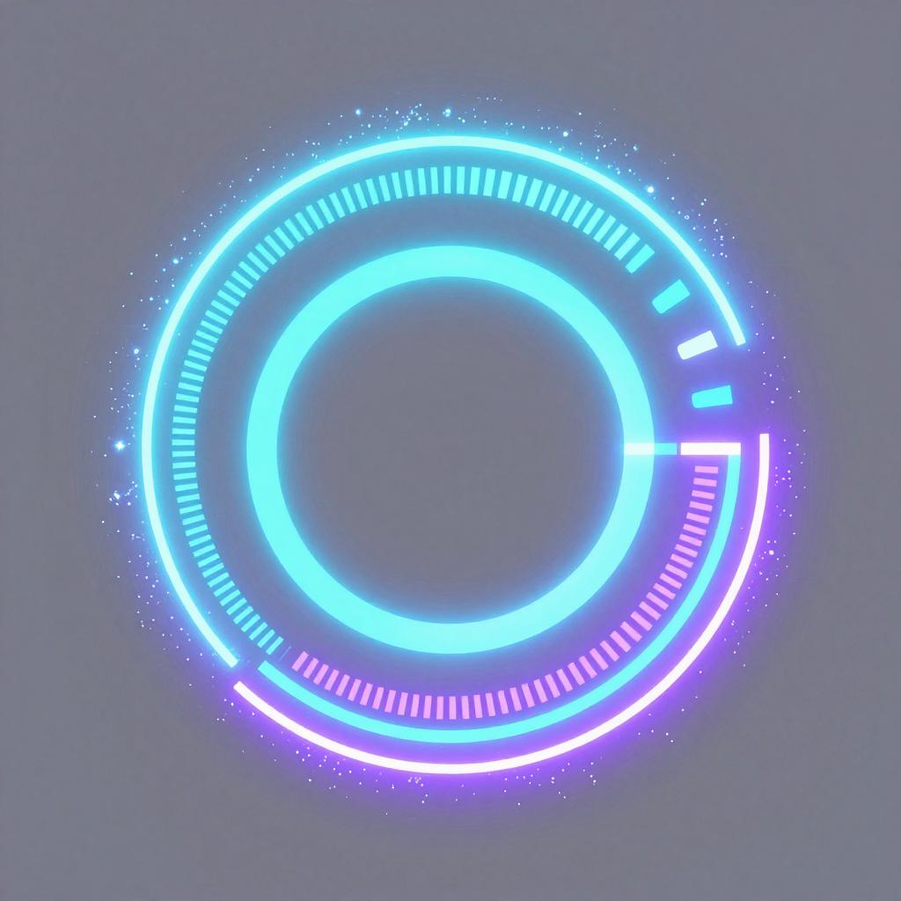

<!-- ════════════════════════════════════════════════════════
     ⚡ W A S I ⚡
     ════════════════════════════════════════════════════════ -->

 

 

**🎓 Grade 11 · A-Levels** — Physics ⚛️ | Chemistry ⚗️ | Mathematics 📐

 

---

## 📡 Connect Across The Universe

---

## ✨ About Me

| Attribute | Details |
|-----------|---------|
| **Identity** | Quantum Developer |
| **Education** | Grade 11 · A-Levels |
| **Subjects** | Physics · Chemistry · Mathematics |
| **Passions** | Astronomy · Quantum Physics · Computer Science |
| **Project** | Was Ecosystem 🛠️ (Open-Source) |
| **Philosophy** | Everything is Connected |

<blockquote>
  
<strong>Fun Fact:</strong> I build things to simplify my life... and accidentally simplify yours 😎

</blockquote>

📖 Click to Expand My Story

> 
> 🔭 Grade 11 science student who believes all knowledge is one connected web. Academically rooted in Physics, Chemistry & Mathematics — but my curiosity escapes the syllabus into **astrophysics, quantum physics and AI**.
>
> 💡 Computer Science started as a hobby… then became a craft. From bare-metal fundamentals to modern machine learning.
>
> 🤝 Currently architecting the **Was Ecosystem** — an open-source project to make digital life simpler.
>
> 💬 **Ask me about Open Science** — knowledge should be free, accessible, and reproducible!

---

## 🧬 Tech Arsenal

---

## 🛸 Flight Deck — Mission Metrics

## ⏱️ Hackatime — Live From The Lab

### 🔥 Coding Heatmap

---

## 🎓 Current Expedition Log

| Field | Status | Destination |
|:---:|:---:|:---:|
| **Astrophysics** | ✈️ In Flight | Black holes · Relativity · Cosmology |
| **Quantum Physics** | ✈️ In Flight | Entanglement · Quantum Computing |
| **Computer Science** | 🚀 Cruising | Core → AI Architectures |
| **Chemistry** | ✈️ In Flight | Molecular Dynamics |
| **Was Ecosystem** | 🛠️ Building | Open-source Launch Pad |

---

<blockquote>
  
"The universe runs on mathematics. Software runs on logic. I run on curiosity."

  <small>⚛️</small>
</blockquote>

---

---
